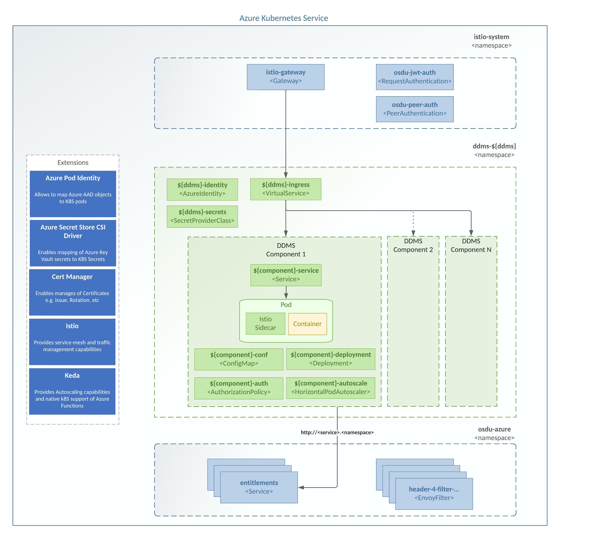

# Helm Chart for OSDU DDMS on Azure
All DDMSs services have been moved to the common K8S architecture and use of common Helm chart (`standad-ddms`).
Individual DDMSs helm charts are **DEPRECATED!** and will be not supported starting from OSDU M12 (`release/0.15`)




## Pulling Helm Chart
Helm Charts are stored in OCI format and stored in an Azure Container Registry for Convenience.
```bash
CHART="standard-ddms"
VERSION="1.20.0"

ACR='msosdu.azurecr.io'

# Pull Chart
helm pull "oci://$ACR/helm/$CHART" --version $VERSION --untar
```

## Deploying Services

```bash
az login --service-principal -u $ARM_CLIENT_ID -p $ARM_CLIENT_SECRET --tenant $ARM_TENANT_ID

UNIQUE=<uniquename>
ingress_dns=<youringress>
GROUP=$(az group list --query "[?contains(name, 'cr${UNIQUE}')].name" -otsv)
ENV_VAULT=$(az keyvault list --resource-group $GROUP --query [].name -otsv)

azure_tenant=$(az keyvault secret show --id https://${ENV_VAULT}.vault.azure.net/secrets/tenant-id --query value -otsv)
azure_subscription=$(az keyvault secret show --id https://${ENV_VAULT}.vault.azure.net/secrets/subscription-id --query value -otsv)
azure_resourcegroup=$(az keyvault secret show --id https://${ENV_VAULT}.vault.azure.net/secrets/base-name-cr --query value -otsv)-rg
azure_identity=$(az keyvault secret show --id https://${ENV_VAULT}.vault.azure.net/secrets/base-name-cr --query value -otsv)-osdu-identity
azure_identity_id=$(az keyvault secret show --id https://${ENV_VAULT}.vault.azure.net/secrets/osdu-identity-id --query value -otsv)
azure_keyvault=${ENV_VAULT}
azure_acr=msosdu.azurecr.io


function deploy() {
  local ddms=$1
  local deployment='osdu'
  local base_dir="./standard-ddms/"
  local helm_release="$ddms-services"
  local helm_value_file="${base_dir}${ddms}.${deployment}.values.yaml"
  local k8s_namespace="ddms-$ddms"

  # Uninstall if Helm release is not-compatible
  # helm uninstall $helm_release -n $k8s_namespace

  # Create K8S Namespace with configured Istio sidecar ingejction
  kubectl create namespace $k8s_namespace && \
  kubectl label namespace $k8s_namespace istio-injection='enabled'
  echo "helm upgrade -i $helm_release $base_dir -n $k8s_namespace -f $helm_value_file"

  helm upgrade -i \
  $helm_release $base_dir \
  -n $k8s_namespace \
  -f $helm_value_file \
  --set azure.tenant=$azure_tenant \
  --set azure.subscription=$azure_subscription \
  --set azure.resourcegroup=$azure_resourcegroup \
  --set azure.identity=$azure_identity \
  --set azure.identity_id=$azure_identity_id \
  --set azure.keyvault.name=$azure_keyvault \
  --set azure.acr=$azure_acr \
  --set ingress.dns=$ingress_dns
}

# Ensure your context is set.
az account set --subscription '<AKS Subscription ID>'
az aks get-credentials --resource-group '<AKS Resource Group>' --name '<AKS resource name>'

# This is specific to OSDU instance:
azure_tenant='...'
azure_subscription='...'
azure_resourcegroup='...'
azure_identity='...'
azure_identity_id='...'
azure_keyvault='...'
azure_acr='...'
ingress_dns='...'

# Deploying DDMSs services
deploy "wellbore"
deploy "seismic"
deploy "well-delivery"
deploy "reservoir"
```
